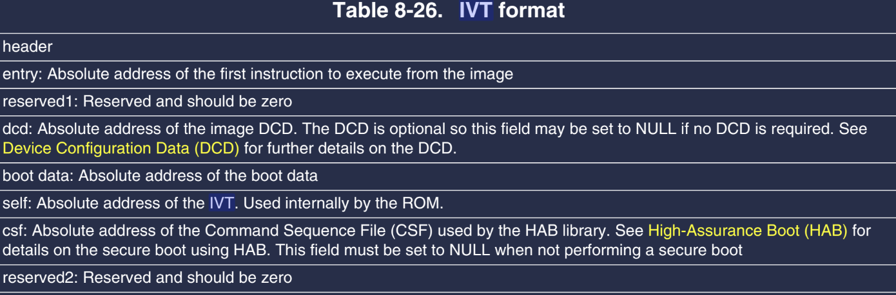
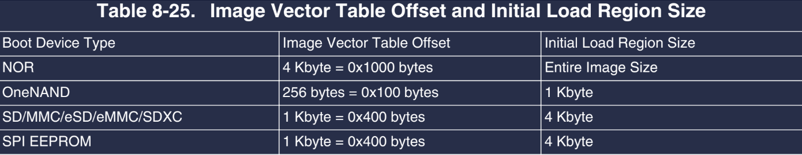

# 启动流程解析

根据制作的镜像.imx文件可知, 烧录到SD卡的`.imx`文件中同时包含了IVT+DCD+BOOT Data等信息. 随后才是具体的`.bin`程序文件.  为什么?  并且从芯片启动开始, 是如何运行存储介质(EMMC/SD/NAND)中的程序的呢?

在IMX6ULL已经规定好了IVT, DCD, BOOT Data的数据字段含义以及偏移量位置, 以及在SD卡中的位置. IVT起始位置偏移SD卡`1KB`的地址, 这些算是协议规定. 而硬件上电时也有固定的规则. 具体的数据规则如下

IVT的数据定义格式, 其中`entry`是程序在内存中的镜像地址(即`.bin`的起始地址,). `self`描述的是IVT自己的地址, BOOT ROM程序会在指定位置读取IVT后 ,与此值进行比较, 算是一种校验.

并且因为

> Note: 注意`IVT->self`, `IVT->entry`, `BOOT Data->start`三者的"位置关系", self表示IVT自身在内存的绝对地址, 不包括前面的1kb的SD卡预留空间, entry表示用户程序(.imx file 除去 IVT+DCD+BOOT Data后的用户程序)的地址, 而BOOT Data's start 则表示的是整个镜像文件在内存(DDR)的起始地址.

## 上电时

上电后,  CPU会被强制复位到Boot ROM 启动向量位置, 这块的程序是芯片出场时写死的, 是一个固定程序, 主要进行了时钟, cpu等维持CPU基本工作的外设/芯片的初始化. (Boot ROM 是芯片自带的一小块存储介质, 几十KB). 随后会根据BOOT CONFIG位的配置情况决定后续程序启动方式, 如从SPI Flash/SD/NAND/EMMC等方式进行

### BOOT CONFIG 设置为SD卡启动时

当BOOT ROM上的固件程序运行后, 由于设置的是SD卡启动,  因此在BOOT ROM程序中就出现了读取SD卡的指令,  此时CPU可以通过SD卡控制器读取指定大小的数据(对于IMX6ULL, 这是4KB, 包括了IVT+DCD+BOOT Data,), 这个同样是硬件规定好的. 读取后就可以进行数据解析, 获取这三个量的偏移地址. 

上图表明了不同存储镜像的介质, cpu的boot rom 初始读取的字节范围.

当BOOT ROM 解析完毕后, 会检查是否有DCD地址, 如果有则开始初始化DDR内存(因为DDR属于外部内存, 同样需要初始化),  如果DDR内存初始化成功了, 此时BOOT ROM 上的程序就可以根据BOOT DATA定义的`start`地址, 将镜像文件拷贝到DDR内存上. 然后再根据解析出来的`IVT->entry`将程序PC指针指向用户程序, 至此整个启动流程完成. 

